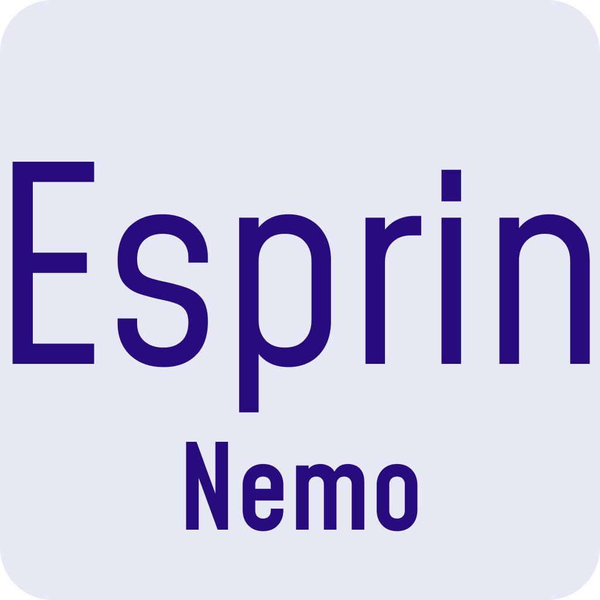
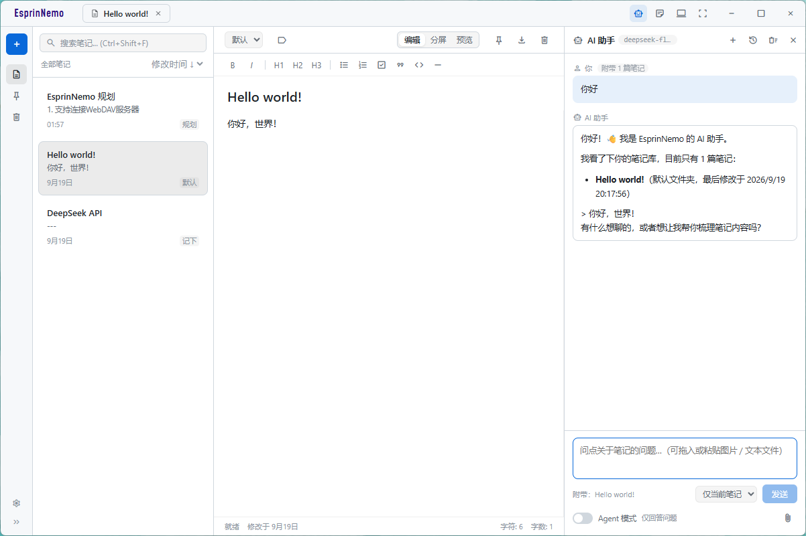

<!--  -->

# Esprin Nemo

> Note, Nothing.
>
> 简约不简单。

一个本地优先、离线可用的极简 Markdown 笔记应用。没有账号、没有云同步，笔记就是磁盘上的 `.md` 文件。
内置的 AI 助手是唯一的联网功能：需要自己配置 API 站点、KEY 与模型，不配置就不会发起任何外部请求。



---

## 功能特性

### 笔记管理
- **纯 Markdown 存储**：每篇笔记正文独立保存为 `data/notes/{id}.md`，可直接用任意编辑器打开
- **多标签页**：标题栏标签页同时打开多篇笔记，随时切换
- **文件夹与标签**：侧边栏按文件夹归类、按标签过滤，内置「全部笔记 / 已置顶 / 废纸篓」视图
- **排序方式**：修改时间、创建时间、标题 A-Z
- **废纸篓**：删除先进废纸篓，支持一键彻底清空，可设置自动清理保留天数
- **导出**：任意笔记一键导出为 `.md` 文件

### 编辑体验
- **三种视图模式**：编辑 / 分屏 / 预览
- **格式化工具栏**：加粗、斜体、H1–H3、无序列表、有序列表、待办清单、引用、代码块、分割线
- **实时预览**：内置轻量 Markdown 渲染，分屏即时对照
- **实时状态**：保存状态、最后修改时间、字符数与字数统计

### 外观与偏好
- **主题**：浅色 / 深色 / 跟随系统，首屏渲染前同步注入，切换无闪屏
- **主题色个性化**：强调色可选预设色板或自定义取色（支持 #RRGGBB / #RGB），实时预览并即时落盘，深浅主题下自动换算背景透明度与按钮文字色，消息弹窗同步生效
- **应用名颜色**：标题栏左上角「EsprinNemo」的文字颜色可在「品牌色 / 黑或白（深色模式白字、浅色模式黑字）/ 跟随主题色」间切换，弹窗标题栏同步生效
- **字体自定义**：界面字体与文档字体可分别设置，西文与 CJK 字体分开配置，按字符逐个回退
- **本机字体列表**：直接解析字体文件 `name` 表枚举字体，无需第三方依赖，并带实时预览
- **小本本**：标题栏一键唤出屏幕右下角的便利贴小窗口，始终置顶，标题栏只有「选择笔记 / 保存 / 最小化 / 关闭」；自带标题与正文输入，自动保存，`Ctrl + S` 保存。未关联笔记时内容属于小本本自己（数据目录下的 `scratchpad.json`），点保存即在后台新建一篇笔记并自动关联；点选择可搜索并打开已有笔记，之后小本本里编辑的就是那篇笔记

  

### AI 助手（可选）
- **总开关**：默认开启，可在「设置 → AI 助手」顶部一键关闭；关闭后标题栏入口与对话面板一并隐藏、不再发起任何请求，配置原样保留
- **自带接口配置**：在「设置 → AI 助手」中填写 API 站点、API Key 与模型，兼容 OpenAI 协议的站点都可直接使用；地址旁提供 DeepSeek 与 Ollama 的快捷填入按钮
- **模型列表与连接测试**：一键从站点拉取模型候选，也可发送一条最短请求验证站点 / KEY / 模型是否都可用
- **结合笔记提问**：提问时可附带笔记内容作为上下文，范围可选「仅当前笔记 / 全部笔记 / 不附带笔记」，附带数量与字数都有上限，避免一次塞进过多内容
- **流式回答**：回答逐字生成，可随时停止；完成后可复制、插入当前笔记或存为新笔记（回答按 Markdown 渲染）
- **多对话**：面板顶部可新建对话、打开「对话记录」列表在历史对话间切换，并支持重命名、删除与清空当前对话；标题默认取第一条提问，可手动改。生成过程中切走也不会串台，回答仍写回发起它的那份对话
- **上传图片与文件**：输入框右下角的回形针可以选择图片 / 文本文件，也可直接把文件从文件管理器拖进面板或输入框、或在输入框里粘贴截图（在文件管理器里复制文件后直接粘贴同样可行）；图片按多模态（`image_url`）发给模型，文本文件的内容会内联进提问。单条消息最多 6 个附件，图片不超过 10 MB、文本文件不超过 1 MB
- **Agent 模式（可选）**：输入框下方的开关，打开后模型可以调用工具直接读写笔记——搜索/阅读笔记、新建笔记、修改正文（整体重写或追加）、改标题 / 文件夹 / 标签 / 置顶、新建文件夹，以及把笔记移入废纸篓。每一步都会在对话里列成一张操作卡片，带「撤销」按钮（可还原正文、元数据、新建的笔记与文件夹、废纸篓状态）；移入废纸篓前仍会单独弹窗向你确认
- **自定义人设**：可填写系统提示词约束 AI 的身份与回答风格，留空则使用内置提示词
- **密钥不出渲染层**：请求由主进程代理发出，API Key 只从本机 `config.json` 读取，不经 IPC 往返

### 数据与隐私
- **完全离线**：不联网、不上传、无遥测（主动使用 AI 助手时除外，详见下文）
- **安装即可选位置**：Windows 安装向导可选择安装位置与数据存放位置（默认位置或任意目录）
- **数据目录可迁移**：在设置中更改数据存放位置，自动迁移现有笔记并即时生效，无需重启
- **安装版与开发版隔离**：安装版使用应用配置目录，开发版使用项目内 `data/`

## 快捷操作

| 快捷键 | 功能 |
| --- | --- |
| `Ctrl + N` | 新建笔记 |
| `Ctrl + Shift + F` | 聚焦搜索框 |
| `Ctrl + S` | 保存当前笔记 |
| `Ctrl + S`（小本本窗口） | 未关联笔记时新建为笔记并关联，已关联时保存回那篇笔记 |
| `Ctrl + O`（小本本窗口） | 打开笔记选择面板 |
| `Tab`（编辑器内） | 插入缩进 |

## 快速开始

### 环境要求

- Node.js 与 bun
- 主要面向 Windows，构建配置同时提供 Linux AppImage 目标

### 安装与运行

```bash
# 安装依赖
bun install

# 开发运行
bun run start
```

### 打包

```bash
bun run build
```

Windows 下由 electron-builder 生成安装包，产物位于 `dist/`。安装包为向导式（非一键安装）：

- **可选择安装位置**（`nsis.allowToChangeInstallationDirectory`）
- **可选择数据存放位置**（`src/win_installer/installer.nsh` 提供的自定义向导页），
  选择结果写入 `%APPDATA%\esprin_nemo\data_path.json`；该记录已存在时向导不再询问，
  位置改在应用内“设置 → 数据存放位置”中调整

实现细节见 [`src/win_installer/README.md`](src/win_installer/README.md)。

## 数据存储

```
data/
├── config.json     # 偏好设置：主题、主题色、应用名颜色、字体、拼写检查、废纸篓保留天数、AI 接口配置等
├── index.json      # 笔记索引：标题、文件夹、标签、置顶/回收状态、时间戳
├── scratchpad.json # 小本本：关联的笔记 ID 与标题/正文缓存
├── ai_chats.json   # AI 对话记录：全部对话及其消息，以及当前选中的对话
├── ai_files/       # AI 图片附件（对话记录里只存文件名，请求时才读成 base64）
└── notes/
    ├── <id>.md     # 笔记正文
    └── ...
```

索引只保存元数据、不保存正文，因此笔记数量增长时列表加载依然轻快。数据位置记录在 `%APPDATA%\esprin_nemo\data_path.json`（位于数据目录之外，迁移后仍能找回）：

```json
{
  "dataDir": "D:/Notes"
}
```

安装向导与应用内“设置 → 数据存放位置”读写的是同一个文件、同一个字段，因此不存在优先级冲突。安装版启动时按下面的顺序解析数据目录：

```
data_path.json 中的位置（安装时选择或应用内更改）
  → %APPDATA%\esprin_nemo\data
```

因此“恢复默认”会删掉记录并回到 `%APPDATA%\esprin_nemo\data`；记录文件里统一使用正斜杠（安装向导的 NSIS 脚本不擅长转义反斜杠），应用读取时会换算成当前平台的写法。

开发运行（`bun start`，即 `electron .`）则完全绕过上面这套机制：数据固定为项目内的 `data/`，不读取也不写入 `data_path.json`，设置中的“数据存放位置”整行置灰并提示“当前为开发运行，无法更改数据存放位置”，从而不会把正式记录写成开发时的临时选择。

> 提示：整个数据目录就是一份可备份的数据。复制它即可完成迁移，用 Git 初始化它即可获得完整的历史版本。

## AI 助手

AI 助手可通过「设置 → AI 助手」顶部的总开关关闭，关闭后界面中不再保留任何 AI 入口（标题栏按钮与对话面板一并隐藏），也不会发起网络请求。默认开启，需要先完成配置：

| 配置项 | 说明 |
| --- | --- |
| 启用 AI 助手 | 总开关，关闭后隐藏全部 AI 入口，配置保留 |
| API 站点 | 兼容 OpenAI 协议的服务地址，可写到版本号一级（如 `https://api.openai.com/v1`），也可直接填写完整的 `/chat/completions` 地址；地址下方提供 **DeepSeek**（`https://api.deepseek.com`）与 **Ollama**（`http://localhost:11434`）的快捷填入按钮 |
| API Key | 仅保存在本机 `config.json` 中，只用于请求上方站点；本地服务（如 Ollama）可留空 |
| 模型 | 模型名称，可点「获取列表」从站点拉取候选，也可手动填写 |
| 默认附带范围 | 提问时默认带上的笔记：仅当前笔记 / 全部笔记 / 不附带笔记 |
| 单次最多附带笔记 | 「全部笔记」时最多带上的篇数，按置顶与最近修改排序 |
| 系统提示词 | 留空使用内置提示词；填写后用于约束 AI 的身份与回答风格 |

Agent 模式在对话面板的输入框下方开关（不会改变设置里的其他配置），默认关闭。打开后：

- 模型可调用的工具：`list_notes`（按文件夹 / 标签 / 关键词搜）、`read_note`、`create_note`、`update_note_content`（整体重写或追加）、`update_note_meta`（标题 / 文件夹 / 标签 / 置顶）、`create_folder`、`trash_note`
- 所有改动都走应用到同一套读写逻辑，因此列表、标签栏、编辑器与 `index.json` 会立即保持一致，落盘方式与手动编辑完全相同
- 单次提问最多执行 6 步工具调用，避免模型陷入循环；过程中可随时「停止」
- 每一步操作都会在对话里显示为一张卡片（含结果），写操作带「撤销」；撤销快照只保留在本次运行内，重启后不再提供撤销
- `trash_note` 属于删除类操作，即使由 AI 发起也会先弹窗确认，且只移入废纸篓（可在废纸篓恢复）

填写完成后可以点「测试连接」发一条最短请求验证配置，随后在标题栏点「AI 助手」图标打开右侧问答面板。面板顶部可临时切换本次会话的附带范围，输入框 `Enter` 发送、`Shift + Enter` 换行，生成过程中可随时「停止」。

关于隐私与联网：

- 只有在你主动提问（或点击获取模型列表 / 测试连接）时才会发起网络请求，请求发往你自己配置的 API 站点，不走任何中转服务
- API Key 以明文保存在本机数据目录的 `config.json` 中，请勿把该文件或整个数据目录分享给他人
- 笔记内容只在提问时按所选范围发送给你配置的站点；「不附带笔记」时只发送你的问题
- 打开 Agent 模式后，一次提问可能包含多次请求（模型每读一篇笔记、每完成一步都会再请求一次），这时发送哪些笔记由模型选择的工具决定，不再只取决于附带范围；工具的执行结果（含笔记正文）同样会发回给你配置的站点
- 对话记录（含你的提问与 AI 的回答）保存在本机数据目录的 `ai_chats.json` 中，与笔记同样属于可备份、可迁移、可删除的本地数据；删除对话或清空对话会立即从该文件移除对应内容
- 对话记录保留上限为 50 份对话、单份对话最近 120 条消息，超出后自动丢弃最久未使用的部分
- 上传的图片会拷贝一份到本机 `ai_files/` 目录（原文件之后被改动或删除都不影响已发送内容），只在发起请求时读成 base64 发给站点；文本文件的内容则直接内联在对话记录里
- 为了避免每轮都重传图片，历史轮次里的图片只会在请求中留下一行占位，只有最近一次提问会带上原图；删除对话或清空对话时，对应的图片文件会一并从 `ai_files/` 删除

`config.json` 中的对应字段：

```json
{
  "ai": {
    "enabled": true,
    "agentMode": false,
    "baseUrl": "https://api.deepseek.com",
    "apiKey": "sk-…",
    "model": "deepseek-chat",
    "scope": "current",
    "maxNotes": 10,
    "systemPrompt": ""
  }
}
```

## 项目结构

```
├── package.json            # "main" 指向 src/main/main.js
├── assets/
│   └── icon.png            # 应用图标（窗口 + 构建资源）
├── src/
│   ├── main/               # 主进程
│   │   ├── main.js         # 窗口、菜单、数据目录解析与迁移、IPC
│   │   ├── ai_service.js   # AI 助手：兼容 OpenAI 协议的对话代理与模型列表
│   │   ├── data_path.js    # 数据目录解析：默认位置、自定义位置记录、迁移
│   │   ├── dialog_window.js# 自绘标题栏的消息弹窗（提示 / 确认 / 输入）
│   │   ├── scratchpad_window.js # 小本本：右下角置顶便利贴小窗口与内容读写
│   │   ├── font_list.js    # 跨平台本机字体枚举（解析字体文件 name 表）
│   │   └── ui_defaults.js  # 全局界面默认值注入（焦点描边、Tab 行为）
│   ├── win_installer/      # Windows 安装器：NSIS 自定义向导页（数据存放位置）
│   │   ├── installer.nsh   # electron-builder nsis.include
│   │   └── README.md       # 安装器说明
│   └── renderer/           # 渲染进程
│       ├── main.html       # 主窗口：界面骨架 + 外链样式与脚本
│       ├── dialog.html     # 弹窗窗口页面
│       ├── scratchpad.html # 小本本窗口页面（标题 + 正文、选择笔记、Ctrl+S 保存）
│       ├── boot.js         # 首屏引导：数据目录解析、主题 / 主题色 / 字体预注入（无闪屏）
│       ├── fonts/          # 随应用分发的品牌字体（Mohave）
│       ├── styles/         # tokens / base / sidebar / editor / overlays / settings / ai
│       └── scripts/        # state / storage / markdown / ui / theme_color / notes / scratchpad / editor / ai / ai_chats / ai_files / ai_agent / render …
├── data/                   # 开发版数据目录（已 gitignore）
├── dist/                   # 构建产物（已 gitignore）
└── readme/                 # 文档配图
```

> 渲染进程按“经典脚本”拆分：`src/renderer/scripts/` 下的文件共享同一个全局作用域，`state.js`
> 必须在其它脚本之前加载，`app.js` 负责在 `window.onload` 时启动应用。

## 技术栈

- **Electron 44**：主进程（`src/main/`）+ 渲染进程（`src/renderer/`），无打包步骤，直接加载 `main.html`
- **原生 JavaScript / HTML / CSS**：界面基于 CSS 变量实现主题与字体切换
- **Node.js 文件系统直读直写**：渲染进程通过 `require('fs')` 直接读写数据目录
- **material-symbols**：图标字体
- **Mohave**：左上角品牌字体（SIL Open Font License）

## 许可与致谢

- 品牌字体 [Mohave](src/renderer/fonts/Mohave/) 遵循 SIL Open Font License，授权全文见 `src/renderer/fonts/Mohave/OFL.txt`
- 图标来自 [material-symbols](https://github.com/google/material-design-icons)

---

如果这个小工具帮到了你，欢迎点个 ⭐。有问题或想法请提 [Issue](https://github.com/TheOninesixY/EsprinNemo/issues)。