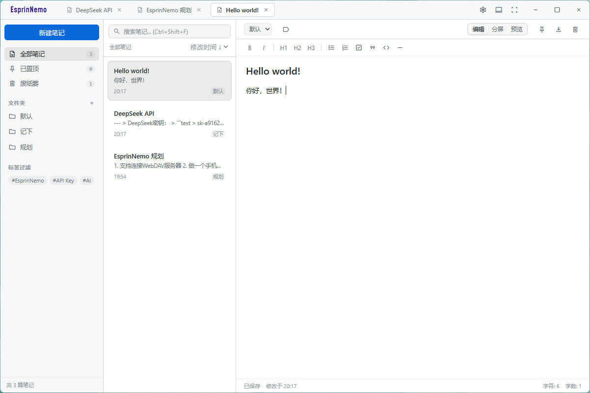

<!--  -->

# Esprin Nemo

> Note, Nothing.
>
> 简约不简单。

一个本地优先、离线可用的极简 Markdown 笔记应用。没有账号、没有云同步、没有多余的网络请求——笔记就是磁盘上的 `.md` 文件。



---

## 功能特性

### 笔记管理
- **纯 Markdown 存储**：每篇笔记正文独立保存为 `data/notes/{id}.md`，可直接用任意编辑器打开
- **多标签页**：标题栏标签页同时打开多篇笔记，随时切换
- **文件夹与标签**：侧边栏按文件夹归类、按标签过滤，内置「全部笔记 / 已置顶 / 废纸篓」视图
- **排序方式**：修改时间、创建时间、标题 A-Z
- **废纸篓**：删除先进废纸篓，支持一键彻底清空，可设置自动清理保留天数
- **导出**：任意笔记一键导出为 `.md` 文件

### 编辑体验
- **三种视图模式**：编辑 / 分屏 / 预览
- **格式化工具栏**：加粗、斜体、H1–H3、无序列表、有序列表、待办清单、引用、代码块、分割线
- **实时预览**：内置轻量 Markdown 渲染，分屏即时对照
- **实时状态**：保存状态、最后修改时间、字符数与字数统计

### 外观与偏好
- **主题**：浅色 / 深色 / 跟随系统，首屏渲染前同步注入，切换无闪屏
- **字体自定义**：界面字体与文档字体可分别设置，西文与 CJK 字体分开配置，按字符逐个回退
- **本机字体列表**：直接解析字体文件 `name` 表枚举字体，无需第三方依赖，并带实时预览

### 数据与隐私
- **完全离线**：不联网、不上传、无遥测
- **安装即可选位置**：Windows 安装向导可选择安装位置与数据存放位置（默认位置或任意目录）
- **数据目录可迁移**：在设置中更改数据存放位置，自动迁移现有笔记并即时生效，无需重启
- **安装版与开发版隔离**：安装版使用应用配置目录，开发版使用项目内 `data/`

## 快捷操作

| 快捷键 | 功能 |
| --- | --- |
| `Ctrl + N` | 新建笔记 |
| `Ctrl + Shift + F` | 聚焦搜索框 |
| `Ctrl + S` | 保存当前笔记 |
| `Tab`（编辑器内） | 插入缩进 |

## 快速开始

### 环境要求

- Node.js 与 bun
- 主要面向 Windows，构建配置同时提供 Linux AppImage 目标

### 安装与运行

```bash
# 安装依赖
bun install

# 开发运行
bun run start
```

### 打包

```bash
bun run build
```

Windows 下由 electron-builder 生成安装包，产物位于 `dist/`。安装包为向导式（非一键安装）：

- **可选择安装位置**（`nsis.allowToChangeInstallationDirectory`）
- **可选择数据存放位置**（`src/win_installer/installer.nsh` 提供的自定义向导页），
  选择结果写入 `%APPDATA%\esprin_nemo\data_path.json`；该记录已存在时向导不再询问，
  位置改在应用内“设置 → 数据存放位置”中调整

实现细节见 [`src/win_installer/README.md`](src/win_installer/README.md)。

## 数据存储

```
data/
├── config.json     # 偏好设置：主题、字体、拼写检查、废纸篓保留天数等
├── index.json      # 笔记索引：标题、文件夹、标签、置顶/回收状态、时间戳
└── notes/
    ├── <id>.md     # 笔记正文
    └── ...
```

索引只保存元数据、不保存正文，因此笔记数量增长时列表加载依然轻快。数据位置记录在 `%APPDATA%\esprin_nemo\data_path.json`（位于数据目录之外，迁移后仍能找回）：

```json
{
  "dataDir": "D:/Notes"
}
```

安装向导与应用内“设置 → 数据存放位置”读写的是同一个文件、同一个字段，因此不存在优先级冲突。应用启动时按下面的顺序解析数据目录：

```
data_path.json 中的位置（安装时选择或应用内更改）
  → %APPDATA%\esprin_nemo\data（开发版为项目内 data/）
```

因此“恢复默认”会删掉记录并回到 `%APPDATA%\esprin_nemo\data`；记录文件里统一使用正斜杠（安装向导的 NSIS 脚本不擅长转义反斜杠），应用读取时会换算成当前平台的写法。

> 提示：整个数据目录就是一份可备份的数据。复制它即可完成迁移，用 Git 初始化它即可获得完整的历史版本。

## 项目结构

```
├── package.json            # "main" 指向 src/main/main.js
├── assets/
│   └── icon.png            # 应用图标（窗口 + 构建资源）
├── src/
│   ├── main/               # 主进程
│   │   ├── main.js         # 窗口、菜单、数据目录解析与迁移、IPC
│   │   ├── data_path.js    # 数据目录解析：默认位置、自定义位置记录、迁移
│   │   ├── dialog_window.js# 自绘标题栏的消息弹窗（提示 / 确认 / 输入）
│   │   ├── font_list.js    # 跨平台本机字体枚举（解析字体文件 name 表）
│   │   └── ui_defaults.js  # 全局界面默认值注入（焦点描边、Tab 行为）
│   ├── win_installer/      # Windows 安装器：NSIS 自定义向导页（数据存放位置）
│   │   ├── installer.nsh   # electron-builder nsis.include
│   │   └── README.md       # 安装器说明
│   └── renderer/           # 渲染进程
│       ├── main.html       # 主窗口：界面骨架 + 外链样式与脚本
│       ├── dialog.html     # 弹窗窗口页面
│       ├── boot.js         # 首屏引导：数据目录解析、主题与字体预注入（无闪屏）
│       ├── fonts/          # 随应用分发的品牌字体（Mohave）
│       ├── styles/         # tokens / base / sidebar / editor / overlays / settings
│       └── scripts/        # state / storage / markdown / ui / notes / editor / render …
├── data/                   # 开发版数据目录（已 gitignore）
├── dist/                   # 构建产物（已 gitignore）
└── readme/                 # 文档配图
```

> 渲染进程按“经典脚本”拆分：`src/renderer/scripts/` 下的文件共享同一个全局作用域，`state.js`
> 必须在其它脚本之前加载，`app.js` 负责在 `window.onload` 时启动应用。

## 技术栈

- **Electron 44**：主进程（`src/main/`）+ 渲染进程（`src/renderer/`），无打包步骤，直接加载 `main.html`
- **原生 JavaScript / HTML / CSS**：界面基于 CSS 变量实现主题与字体切换
- **Node.js 文件系统直读直写**：渲染进程通过 `require('fs')` 直接读写数据目录
- **material-symbols**：图标字体
- **Mohave**：左上角品牌字体（SIL Open Font License）

## 许可与致谢

- 品牌字体 [Mohave](src/renderer/fonts/Mohave/) 遵循 SIL Open Font License，授权全文见 `src/renderer/fonts/Mohave/OFL.txt`
- 图标来自 [material-symbols](https://github.com/google/material-design-icons)

---

如果这个小工具帮到了你，欢迎点个 ⭐。有问题或想法请提 [Issue](https://github.com/TheOninesixY/EsprinNemo/issues)。