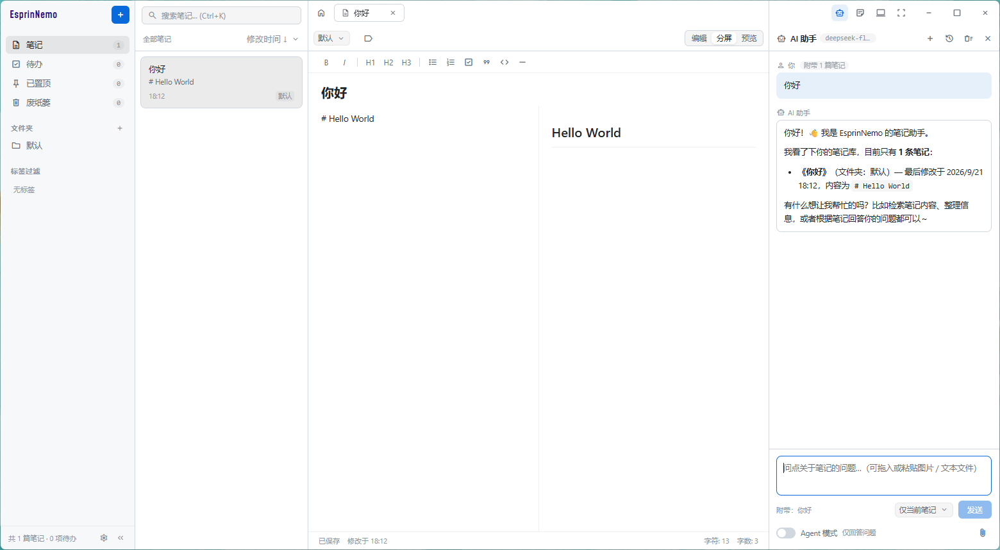

# Esprin Nemo

> Note, Nothing.

本地优先、离线可用的极简 Markdown 笔记应用。无账号体系，无云端托管，笔记以 `.md` 文件保存在本地数据目录，可被任意编辑器直接打开。

网络功能仅有两项，且均需手动配置后才可能发起请求：可选的自建同步（配套 Python 服务端，以操作日志在设备之间同步，删除记录不会被其他设备重新生成）与内置的 AI 助手。两者均未配置时，应用不发起任何外部请求。语音转文本（随口记）不在此列：识别由 Windows 自带的桌面识别引擎在本机完成，音频不出本机，也不发起任何网络请求。

| 资源 | 地址 |
| --- | --- |
| 下载与更新 | [GitHub Releases](https://github.com/TheOninesixY/EsprinNemo/releases) |
| 同步服务端 | [TheOninesixY/EsprinServer](https://github.com/TheOninesixY/EsprinServer) |



## 目录

- [功能特性](#功能特性)
  - [笔记与待办](#笔记与待办)
  - [界面布局（现代 / 经典）](#界面布局现代--经典)
  - [编辑体验](#编辑体验)
  - [随口记（语音转文本）](#随口记语音转文本)
  - [外观与个性化](#外观与个性化)
  - [小本本](#小本本)
  - [托盘与驻留后台](#托盘与驻留后台)
  - [AI 助手（可选）](#ai-助手可选)
  - [自建同步（可选）](#自建同步可选)
  - [自动更新](#自动更新)
  - [数据与隐私](#数据与隐私)
- [快捷键](#快捷键)
- [快速开始](#快速开始)
- [数据存储](#数据存储)
- [自建同步](#自建同步)
- [AI 助手](#ai-助手)
- [应用更新](#应用更新)
- [项目结构](#项目结构)
- [技术栈](#技术栈)
- [许可与致谢](#许可与致谢)

## 功能特性

### 笔记与待办

- **纯 Markdown 存储**：笔记保存为 `data/notes/{id}.md`，待办保存为 `data/todos/{id}.md`。标题、文件夹、标签、置顶与废纸篓状态等元数据以内嵌注释写入文件开头，可被任意编辑器直接打开
- **多标签页**：可同时打开多篇内容，按住标签左右拖动调整顺序，`Ctrl + Tab` / `Ctrl + Shift + Tab` 依次向后 / 向前切换。点击左上角品牌名一次关闭全部标签页并回到首页。默认的现代布局将该行标签置于工作区顶部，可在「设置 → 外观与主题色 → 界面布局」改回标题栏内的经典布局
- **统一新建入口**：侧边栏顶部「新建」按钮展开后可新建笔记（`Ctrl + N`）、新建待办（`Ctrl + Shift + N`），或导入本地 `.md` / `.txt` 文件为笔记（支持多选）。带 EsprinData 注释的文件沿用其中的标题、文件夹与标签；普通 Markdown / 纯文本以文件名作为标题、整份文件作为正文
- **组织方式**：侧边栏提供「笔记 / 待办 / 已置顶 / 废纸篓」四个入口，另有文件夹归类与标签过滤。在已置顶、废纸篓、文件夹与标签视图中，笔记与待办混排于同一列表
- **搜索与排序**：`Ctrl + K` 聚焦搜索框；排序支持修改时间、创建时间与标题 A-Z
- **待办完成状态**：列表卡片左侧的勾选框可切换完成状态（已完成显示删除线）；编辑器顶部的完成按钮与右键菜单提供同一操作
- **右键菜单**：在标签页打开、置顶 / 取消置顶、标记完成（待办）、导出 Markdown、移入废纸篓；废纸篓内的条目提供恢复、导出 Markdown 与彻底删除。置顶、导出与删除不在编辑器顶栏单独设按钮，统一收在右键菜单
- **废纸篓**：笔记与待办共用一个废纸篓，删除先进入废纸篓，支持一键彻底清空，并可设置自动清理的保留天数（永不清理 / 10 / 30 / 60 / 365 天）
- **导出**：笔记或待办可将标题与正文导出为 `.md` 文件，入口在条目右键菜单

### 界面布局（现代 / 经典）

「设置 → 外观与主题色 → 界面布局 → 布局风格」提供两档布局，切换即时生效并写入 `config.json` 的 `uiMode`，默认为 `modern`；旧值 `line` / `notab` / `minimal` 归入现代布局，`standard` 归入经典布局。

| 布局 | `uiMode` | 说明 |
| --- | --- | --- |
| 经典布局 | `classic` | 保留标题栏与标签栏，全部功能入口位于原位置 |
| 现代布局（默认） | `modern` | 移除标题栏，标签栏移至工作区顶部，工具按钮悬浮于窗口右上角 |

现代布局的细则：

- **标签栏**：位于工作区顶部（笔记列表搜索栏所在行），支持点击切换、中键关闭、左右拖动排序与滚轮横向滚动；未打开任何标签时该行自动收起
- **禁用标签页**：仅现代布局下出现的开关（写入 `config.json` 的 `tabsDisabled`）。开启后标签栏不参与排版，编辑器顶栏及以下整列上移，内容直达窗口上沿；标签状态不会丢失，关闭开关即恢复。该模式下 `Ctrl + Tab` / `Ctrl + Shift + Tab` 一并停用（界面上没有标签次序可对照）。切回经典布局时该选项失效，偏好保留
- **悬浮工具组**：窗口操作键与工具按钮（AI 助手 / 小本本 / 主题 / 全屏）悬浮于窗口右上角，占用标签栏所在行，因此标签栏与设置内容各让出右侧 280px 走廊。全屏时窗口按钮不显示，走廊收窄至工具按钮组宽度；AI 面板打开时该走廊归面板所有，面板顶部另有 40px 拖动空白
- **编辑器顶栏**：位于标签栏下方一行，左右内边距均为 8px（与标签栏、侧边栏一致）；标签栏隐藏时上移至工具按钮行，右侧走廊随之恢复
- **应用名与返回**：应用名移至侧边栏顶部，与「新建」按钮同行（名称在左，按钮靠右并收为仅含加号的正方形；侧边栏收起时名称隐藏，仅保留该按钮；应用名仅作展示，不可点击）。返回列表由标签栏最左端的纯图标按钮承担（编辑器打开时滑入，关闭时滑出；编辑器未打开时不出现），设置页的分类侧边栏顶部另有同款「返回」按钮
- **拖动窗口**：由编辑器顶栏空闲段、工作区标签栏空白、笔记列表顶部搜索栏行、设置页顶端的拖动空白与分类侧边栏、空状态工作区、AI 面板顶栏上方留白，以及侧边栏「新建」周边留白承担
- **功能完整性**：文件夹归类、标签过滤、AI 助手、小本本与托盘菜单在两种布局下入口一致
- **切换代价**：仅改变标签栏所在位置，编辑内容、已打开标签与笔记元数据均不受影响。首屏收起状态由 `boot.js` 在渲染前写入 `<html>` 类名，因此不会先渲染完整界面再收起

### 编辑体验

- **三种视图模式**：编辑 / 分屏 / 预览
- **格式化工具栏**：加粗、斜体、H1–H3、无序列表、有序列表、待办清单、引用、代码块、分割线
- **实时预览**：内置轻量 Markdown 渲染，分屏即时对照
- **实时状态**：保存状态、最后修改时间、字符数与字数统计
- **拼写检查**：可在设置中开启，编辑标题与正文时以红色波浪线标出拼写错误
- **侧边栏可收起**：收起状态写入配置，首屏按收起态绘制，不出现展开后补播动画

### 随口记（语音转文本）

编辑器顶栏的麦克风按钮唤出（`Ctrl + Shift + M`），识别结果按句插入光标处（标题框或正文框），插入后由编辑器自身的自动保存链路落盘。

- **本机识别，音频不出本机**：识别走 Windows 自带的桌面识别引擎（`System.Speech` 的 `DictationGrammar`），由主进程拉起一个独立的识别进程完成，音频只进本机引擎——既不经过网络，也不经过渲染进程（因此 Chromium 的麦克风权限保持关闭）
- **语言要先在系统里装好**：识别语言可选普通话 / 英语 / 日语，但系统需为该语言安装「语音识别」功能（Windows 设置 → 时间和语言 → 语言和区域）。未安装时随口记拒绝启动，并列出系统当前可用的语言
- **引擎状态可见**：设置页「系统识别引擎」一行显示系统已安装的识别语言与引擎标识，可随时重新检测
- **聆听反馈**：顶栏按钮点亮成主题色，顶栏下方出现聆听条，显示当前状态与尚未定稿的实时片段——定稿的句子直接进正文，实时片段只作提示，不写进笔记
- **收尾**：再点一次按钮、点聆听条上的「停止」或按 `Esc` 停止；切换条目、进入设置页或条目被移入废纸篓时自动停止，识别结果不会被插到别的条目上
- **麦克风权限**：由系统识别进程访问麦克风，需要在「设置 → 隐私和安全性 → 麦克风」中允许桌面应用访问麦克风

### 外观与个性化

- **主题**：浅色 / 深色 / 跟随系统，首屏渲染前同步注入，切换无闪屏
- **主题风格**：「设置 → 外观与主题色 → 主题风格」可在默认配色与 Alom 风格之间切换。Alom 以柔和投影与层次区分卡片、浮层与背景，配合更大的圆角与半透明材质；两种风格并存，小本本与弹窗同步换肤
- **圆角尺度**：四档（纯方 / 微圆角 / 默认 / 大圆），拖动时连续跟随，松手后吸附至最近档位，也可直接点击档位文字。卡片、按钮、输入框、标签、开关、进度条与滚动条一并跟随，并与主题风格叠加（如 Alom + 大圆）
- **主题色**：预设色板或自定义取色（支持 `#RRGGBB` / `#RGB`），实时预览并即时落盘；深浅主题下自动换算背景透明度与按钮文字色，弹窗同步生效
- **应用名颜色**：标题栏左上角「EsprinNemo」的文字颜色可选品牌色 / 黑或白（跟随明暗）/ 跟随主题色
- **自绘下拉菜单**：所有下拉（主题风格、应用名颜色、字体、废纸篓保留天数、列表排序、笔记文件夹、AI 附带范围等）均为自绘的触发器与弹出列表，不使用 Chromium 原生 `<select>` 弹出层，因此与主题、主题风格、圆角尺度同步变化，并支持键盘上下键 / Enter / Esc 操作。AI 助手的模型输入框（`datalist` 候选）同样使用自绘候选菜单，输入即筛选；原生 `<select>` 与 `<datalist>` 仍保留在页面中充当数据源与事件源
- **字体自定义**：界面字体与文档字体可分别设置，西文与 CJK 分开配置，按字符逐个回退，并带实时预览
- **本机字体列表**：直接解析字体文件的 `name` 表枚举字体，无需第三方依赖

### 小本本

标题栏一键唤出屏幕右下角的便利贴小窗口，始终置顶，标题栏仅有「选择笔记 / 保存 / 最小化 / 关闭」。

- 自带标题与正文输入，自动保存，`Ctrl + S` 保存
- 未关联笔记时，内容属于小本本自身（数据目录下的 `scratchpad.json`）；点击保存即在后台新建一篇笔记并自动关联
- 点击「选择」可搜索并打开已有笔记，此后小本本编辑的即为该篇笔记
- 小本本开启时关闭主窗口不会退出应用：主窗口仅被收起，应用继续在小本本中运行；期间再次启动应用会唤回主窗口（不会另起进程），直到小本本也被关闭，应用才退出


### 托盘与驻留后台

- **系统托盘**：默认在任务栏通知区域显示图标，可在「设置 → 系统与托盘」中关闭。右键图标可打开主窗口、小本本、新建笔记 / 新建待办、进入设置或退出；左键单击将主窗口唤回前台
- **驻留后台**：托盘图标存在时，关闭窗口仅收起界面（应用继续在托盘中运行），完全退出需使用托盘菜单的「退出」。关闭托盘后恢复默认行为：关闭主窗口即退出应用，仅在小本本仍开启时继续驻留
- **开机自启**：可在「设置 → 系统与托盘」中开启，登录系统后自动启动并打开主窗口。实现方式为写入系统登录启动项（Windows 注册表 Run 项、macOS 登录项、Linux `~/.config/autostart` 下的 `.desktop`）；默认关闭，开发运行（`bun start`）不提供该开关

### AI 助手（可选）

默认开启，可在「设置 → AI 助手」顶部关闭；关闭后标题栏入口与对话面板一并隐藏，不再发起任何请求，配置保留。

- **自带接口配置**：填写 API 站点、API Key 与模型即可，兼容 OpenAI 协议的站点可直接使用；地址旁提供 DeepSeek 与 Ollama 的快捷填入按钮
- **API Key 加密保管**：密钥交由系统密钥链加密保存，不写入数据目录，因此备份、同步或分享数据目录都不会带出密钥
- **模型列表与连接测试**：可从站点拉取模型候选，也可发送一条最短请求验证站点 / API Key / 模型是否可用
- **结合笔记提问**：附带范围可选「仅当前笔记 / 全部笔记 / 不附带笔记」，附带数量与字数均有上限
- **流式回答**：逐字生成，可随时停止；完成后可复制、插入当前笔记或存为新笔记（回答按 Markdown 渲染）
- **多对话**：可新建对话，并在「对话记录」列表中切换、重命名、删除与清空；标题默认取第一条提问，可手动修改；生成过程中切换对话不会串台，回答仍写回发起它的那份对话
- **上传图片与文件**：回形针按钮选择图片 / 文本文件，也可直接拖入面板或输入框，或在输入框中粘贴截图（在文件管理器中复制文件后粘贴同样可行）；图片按多模态（`image_url`）发送，文本文件内容内联进提问
- **Agent 模式（可选）**：输入框下方的开关，开启后模型可调用工具直接读写笔记，每一步都会列为带「撤销」的操作卡片
- **自定义人设**：可填写系统提示词约束 AI 的身份与回答风格，留空则使用内置提示词
- **密钥不出渲染层**：请求由主进程代理发出，API Key 由主进程从系统密钥链读取，既不经 IPC 往返，也不出现在页面脚本或配置文件中

详见 [AI 助手](#ai-助手)。

### 自建同步（可选）

默认关闭，可在「设置 → 数据与存储 → 自建同步」中开启；未填写服务器地址时不会发起任何请求。

- **自建服务端**：配套服务端为独立仓库 [TheOninesixY/EsprinServer](https://github.com/TheOninesixY/EsprinServer)，主体是单个 Python 文件（`EsprinServer.py`，仅使用标准库）。数据以「操作日志」形式保存在服务端目录，将日志从头重放一遍即为全部数据
- **删除即删除**：每次保存与删除都会生成一条操作（put / del），服务端为每条操作分配全局递增序号并追加进日志；客户端只记录「已应用到第几号」，同步时拉取其后的操作并重放。删除是一条明确的 tombstone，重放结果与提交方一致，不会出现「A 删除的笔记被 B 依据本地缺文件重新补回」
- **回收 ID**：条目被彻底删除后，服务端把它的路径留在删除记录里（老副本因此不会被推回来），同时把那个 ID 作为「可复用 ID」收进回收池；**删掉它的那台设备本地立刻就能把这个 ID 用在下一次新建上**（不必等同步往返，新建的条目直接就是同一个 ID）。服务端会给其他设备发放回收池里的 ID，领走的会被占住一会儿（条目落盘即释放，过期自动回到池子），两台设备同时新建不会撞到同一个 ID；只有「服务端见过那条删除」的设备才能领，所以不会出现刚用回收 ID 建的条目被自己还没拉到的删除又擦掉
- **重放不回退**：本机自己推上去、服务端已受理的操作，在重放时会跳过（本地早就落盘了）——这正是「删掉一个条目、又用它的 ID 新建」之后，那条删除不会把新条目一起删掉的原因
- **令牌不进配置文件**：访问令牌与 AI Key 共用同一套系统密钥链存储（`src/main/secret_store.js`），数据目录被复制、同步或分享时不会带出令牌
- **本地改动即时推送**：保存与删除后立刻排队推送（同一路径的连续改动合并为一条），无需等待同步间隔
- **启动即同步**：只要自建同步处于开启状态，每次启动应用都会先同步一次（拉取远端操作并推送本地改动），与「自动同步」选了什么无关——启动时本机最可能落后
- **自动同步**：可选「每 5 秒 / 每 1 分钟 / 每 5 分钟 / 自定义（自行填写秒数或分钟数）」，到点自动执行「拉取 → 重放 → 推送」；「不自动同步」只是不定时跑，启动同步与本地改动即时推送照常
- **首次接入**：服务端已有数据时，先将日志完整重放到本地（以服务端为准，包含删除），再将服务端从未见过的本地文件推送上去
- **彻底删除即从日志里消失**：条目被彻底删除（右键彻底删除 / 清空废纸篓 / 过期自动清理）后，服务端会把它的正文与修改历史从 `journal.log` 里抹掉，只留一行删除标记（别的设备靠它知道这个文件已删除，不会把本地残留的老副本推回来）。其余操作的序号一个不动，各设备记的「已应用到第几号」因此照旧有效；管理后台的「整理日志」可以把以前积压的旧记录一并清掉。删除标记上还记着被抹掉那些操作的操作号（只含设备与时间，不含路径与正文），断线重试同一个操作不会把已删除的内容写回来
- **日志即数据**：服务端的数据只有一份操作日志（`journal.log`，一行一条 put / del，追加写入、整理时才会重写）。管理后台可把它整个下载下来；客户端「设置 → 数据与存储 → 文件日志」能把这份日志导入本地（以此为准还原数据），或把它摊成一个与数据目录同构的文件夹
- **按需联网**：同步全部由主进程完成，渲染进程只发送路径通知；地址与设备名随数据目录保存在 `config.json`，令牌仅经 IPC 单向提交，不回传明文

详见 [自建同步](#自建同步)。

### 自动更新

- **默认开启**：启动后自动检查更新源，发现新版本时在后台下载安装包，下载完成后弹窗询问是否立即重启安装
- **更新提醒可关断**：更新弹窗带「永不提醒」勾选框，勾选后关闭窗口即将配置中的「自动检查并下载更新」改为关闭，此后不再自动检查与下载
- **手动可用**：设置页可随时「检查更新」，未开启自动更新时同样可手动检查、下载与安装；可查看版本说明、发布日期与安装包大小，下载进度实时可见且可取消。新版本与当前版本的版本说明均按 Markdown 渲染，当前版本的说明取自该版本在 Releases 中的发布记录
- **应用自行完成升级**：安装包以 `--upgrade` 方式启动，向导不显示任何选择页与对话框，仅保留进度条与「正在更新」提示；安装完成后自动重新打开应用，笔记与数据存放位置记录均不受影响
- **无第三方依赖**：检查走 GitHub Releases API，下载走 Node 内置 `https`，未引入 electron-updater 之类的依赖

详见 [应用更新](#应用更新)。

### 数据与隐私

- **本地优先**：不上传、无遥测；除主动使用自建同步与 AI 助手，以及默认开启的自动更新检查外，不发起任何网络请求，自动更新可在设置中关闭
- **随口记的音频**：只在开始聆听后打开麦克风，停止或收尾时即释放；音频不落盘，应用不保存录音，识别全程在 Windows 本机的识别引擎内完成，不经过网络也不经过渲染进程
- **安装时可选位置**：Windows 安装向导可选择安装位置与数据存放位置（默认位置或任意目录）
- **数据目录可迁移**：在设置中更改数据存放位置，可自动迁移现有笔记并即时生效，无需重启
- **安装版与开发版隔离**：安装版使用应用配置目录，开发版使用项目内 `data/`

## 快捷键

| 快捷键 | 作用范围 | 功能 |
| --- | --- | --- |
| `Ctrl + N` | 主窗口 | 新建笔记 |
| `Ctrl + Shift + N` | 主窗口 | 新建待办 |
| `Ctrl + K` | 主窗口 | 聚焦搜索框 |
| `Ctrl + S` | 主窗口 | 保存当前笔记或待办 |
| `Ctrl + Tab` / `Ctrl + Shift + Tab` | 主窗口 | 在打开的标签之间向后 / 向前切换（现代布局收起标签栏时不生效） |
| `Ctrl + Shift + M` | 主窗口 | 开始 / 停止随口记（语音转文本） |
| `Esc` | 主窗口 | 停止随口记 |
| `Ctrl + S` | 小本本窗口 | 未关联笔记时新建为笔记并关联；已关联时保存回该篇笔记 |
| `Ctrl + O` | 小本本窗口 | 打开笔记选择面板 |
| `Tab` | 编辑器内 | 插入缩进 |

## 快速开始

### 环境要求

- Node.js 与 bun
- 当前仅面向 Windows：安装包（NSIS）与便携版均由 electron-builder 的 `win` 目标产出

### 安装与运行

```bash
# 安装依赖
bun install

# 开发运行
bun start
```

开发运行（`electron .`）完全绕过安装版 / 便携版的数据位置机制：

- 数据固定为项目内的 `data/`，不读取也不写入 `data_path.json`，设置中的「数据存放位置」整行置灰，避免将正式记录写入开发时的临时位置
- Electron 运行时数据（缓存、Cookie、GPU 缓存、崩溃转储、日志）单独存放于 `%APPDATA%\esprin_nemo\dev_user_data`。默认位置与安装版一致时会共用同一把单实例锁，安装版驻留托盘时执行 `bun start`，系统会把「再次启动」交给安装版，开发窗口无法创建；隔离后两者可同时运行，互不干扰

### 打包

```bash
bun run build
```

Windows 下由 electron-builder 生成向导式安装包（非一键安装），产物位于 `dist/`：

| 产物 | 说明 |
| --- | --- |
| `dist/EsprinNemo.Setup.v<版本>.exe` | 安装包。可通过 `nsis.allowToChangeInstallationDirectory` 选择安装位置；首次安装时由 `src/win_installer/installer.nsh` 提供向导页选择数据存放位置。选择结果写入 `%APPDATA%\esprin_nemo\data_path.json`，该记录已存在时不再询问，此后可在「设置 → 数据存放位置」调整 |
| `dist/EsprinNemo.Portable.v<版本>.exe` | 便携版。每次启动解压到临时目录运行，数据、配置与 Electron 运行时数据（`data/`、`data_path.json`、`user_data/`）均位于便携版 exe 所在目录，不写入 `%APPDATA%`。便携版没有稳定的升级目标，因此不做更新检查。所在目录不可写（只读位置、无权限）时不回退到 `%APPDATA%`，而是弹窗说明原因并提供「重新选择路径」 |

打包实现细节见 [`src/win_installer/README.md`](src/win_installer/README.md)。

### 发布新版本

1. 修改 `package.json` 的 `version`，并将本版说明写入 [`.github/releases.md`](.github/releases.md)
2. 推送到 `main` 分支。[`.github/workflows/releases.yml`](.github/workflows/releases.yml) 会在 `windows-latest` 上安装依赖、执行 `bun run build`，产物 `dist/*.exe` 随 tag `v<版本>` 发布到 GitHub Releases（Release 说明取自 `.github/releases.md`；该 tag 已存在时跳过，不重复发布）
3. 旧版本应用的自动更新会检测到该 Release 并升级，见[应用更新](#应用更新)

官网页面位于 [`.github/pages`](.github/pages)，由 [`.github/workflows/pages.yml`](.github/workflows/pages.yml) 自动部署到 GitHub Pages（推送到 `main` 且页面文件有改动时触发，也可手动触发）。

## 数据存储

### 目录结构

```text
data/
├── config.json      # 偏好设置：主题、主题风格、圆角尺度、主题色、应用名颜色、字体、拼写检查、废纸篓保留天数、自动更新、开机自启、托盘图标、自定义文件夹、AI 接口配置、当前选中的对话等
├── scratchpad.json  # 小本本：关联的笔记 ID 与标题 / 正文缓存
├── ai_files/        # AI 图片附件（对话记录中只保存文件名，请求时才读取为 base64）
├── ai_chats/        # AI 对话：一份对话一个文件
│   ├── <id>.json    # 对话本体：id、标题、创建 / 修改时间与全部消息
│   └── ...
├── notes/
│   ├── <id>.md      # 单篇笔记：文件开头的内嵌元数据注释 + Markdown 正文
│   └── ...
└── todos/
    ├── <id>.md      # 单项待办：同一套内嵌元数据注释 + 正文，多一行 isDone
    └── ...
```

### 笔记文件格式

`notes/` 下每篇笔记都是独立的 Markdown 文件，文件名为随机 10 位 ID。标题、文件夹、标签、置顶与废纸篓状态、创建 / 修改时间均以注释形式写在文件开头，因此不存在索引文件：单篇文件自带全部信息，复制、重命名或删除文件即可完成导入与清理：

```markdown
<!--EsprinData
    title: "课堂记录"
    folder:
    tags: []
    isPinned: false
    isTrashed: false
    createdAt: 1789837475335
    updatedAt: 1789840300633
-->

正文…
```

- 注释与正文之间空一行；`folder` 为空表示「默认」文件夹，时间戳单位为毫秒
- 手工放入 `notes/` 的 `.md` 文件会作为新笔记载入：缺少注释时以正文首个非空行作为标题，并在启动时将元数据补写到文件开头；手工修改注释同样在启动时生效
- 从旧版本升级时，`index.json` 中的元数据会在首次启动时并入各笔记文件，原文件归档为 `index.json.bak`

### 待办文件格式

`todos/` 下的待办沿用完全相同的格式（同一套注释字段 + 正文），仅在 `isTrashed` 之后多一行 `isDone: true/false`，例如 `todos/<id>.md`：

```markdown
<!--EsprinData
    title: "交周报"
    folder:
    tags: []
    isPinned: false
    isTrashed: false
    isDone: false
    createdAt: 1789837475335
    updatedAt: 1789840300633
-->

详细说明…
```

- 待办的 `folder` / `tags` 字段与笔记完全一致，文件夹与标签过滤对两者同时生效
- 手工放入 `todos/` 的 `.md` 文件同样会作为待办载入，缺少 `isDone` 时按未完成处理并补写
- 笔记与待办的文件名均为随机 10 位 ID，共用同一套编号空间，两者不会重名

### AI 对话文件格式

AI 对话同样是一份对话一个文件（`ai_chats/<id>.json`，文件名即对话 id），内容为对话本体：

```json
{
  "id": "aB3dE5fG7h",
  "title": "",
  "createdAt": 1789837475335,
  "updatedAt": 1789840300633,
  "messages": []
}
```

- 标题留空时，界面按第一条提问自动生成显示标题（仅用于展示，不写回文件）；删除对话即删除对应文件
- 当前选中的对话仅记录在 `config.json` 的 `aiActiveChat` 字段中，切换对话不会产生多余的文件写入
- 从旧版本升级时，`ai_chats.json` 中的对话会在首次启动时拆分为一份份文件，原文件归档为 `ai_chats.json.bak`

### 数据位置解析

数据位置记录文件存放在数据目录之外，否则切换位置后无法找回。各运行方式的位置如下：

| 运行方式 | 位置记录文件 | 默认数据目录 |
| --- | --- | --- |
| 安装版 | `%APPDATA%\esprin_nemo\data_path.json` | `%APPDATA%\esprin_nemo\data` |
| 便携版 | 便携版所在目录下的 `data_path.json` | 便携版所在目录下的 `data/` |
| 开发运行（`bun start`） | 不使用记录文件 | 项目内 `data/` |

Electron 运行时数据（缓存、Cookie、GPU 缓存、崩溃转储、日志）的位置随之区分：安装版保持 Electron 默认位置，便携版使用程序目录下的 `user_data/`，开发运行使用 `%APPDATA%\esprin_nemo\dev_user_data`。便携版单独存放的原因是其定位为「不写入 `%APPDATA%`」，而默认位置中的缓存、Cookie 与崩溃转储均为实际写入，仅迁移数据文件并不充分，且会与安装版共用同一 profile；开发运行单独存放的原因是不与安装版共用同一把单实例锁。

记录内容：

```json
{
  "dataDir": "D:/Notes"
}
```

安装向导与「设置 → 数据存放位置」读写同一个文件、同一个字段，因此不存在优先级冲突。安装版启动时按以下顺序解析数据目录：

```text
data_path.json 中的位置（安装时选择或应用内更改）
  → %APPDATA%\esprin_nemo\data
```

据此，「恢复默认」会删除记录并回到 `%APPDATA%\esprin_nemo\data`。记录文件统一使用正斜杠（安装向导的 NSIS 脚本不便转义反斜杠），应用读取时换算为当前平台的写法。

便携版沿用同一套顺序，仅将 `%APPDATA%\esprin_nemo` 替换为便携版 exe 所在目录：先在便携版目录下创建 `data/` 存放数据，记录文件同样位于该目录；在设置中选择其他位置后，`data_path.json` 仍落在便携版目录，「恢复默认」则删除记录并回到便携版目录下的 `data/`。便携版不读取也不写入 `%APPDATA%` 中的记录，因此与安装版（或多份便携版）可以并存而互不干扰；整个便携版目录复制到其他位置后，数据与设置随之迁移。

便携版位于只读位置（光盘、只读共享盘、受策略限制的程序目录）时无法写入：此时应用不会改投 `%APPDATA%`，而是终止启动，并弹出与界面同风格的窗口式提示，说明程序目录与数据目录的位置及写入失败原因。同理，记录的数据位置（移动硬盘、网络共享等）连不上或不可写时也不会静默改用默认位置。「数据与设置随程序目录走」是便携版的定义性行为，改投系统盘或空目录会导致无法在便携版目录中找到笔记，并可能与安装版（或另一份便携版）的记录与数据互相覆盖。可写性判断会实际写入并删除一个空文件，因此目录只读属性、ACL 与只读盘均可识别。

只要目录可读（即使不可写），启动弹窗都会提供「重新选择路径」：选择可写目录后应用即以该目录启动；所选目录不可写时会就地提示并允许重新选择，关闭提示则回到启动弹窗。位置记录可写时（记录指向的目录不可用、默认 `data/` 无法创建两种情况），选择会写回 `data_path.json` 并在下次启动生效；便携版程序目录本身不可写时记录无处可写，弹窗会注明该选择仅在本次运行生效。应用内数据位置操作失败时（选到不可写目录、迁移失败、恢复默认位置失败）同样弹出带「重新选择路径」的提示，而非仅报告错误。

开发运行（`bun start`，即 `electron .`）完全绕过上述机制：数据固定为项目内的 `data/`，不读取也不写入 `data_path.json`，「数据存放位置」整行置灰并提示「当前为开发运行，无法更改数据存放位置」。

> 整个数据目录即一份可备份数据。复制该目录即可完成迁移，用 Git 初始化即可获得完整历史版本。

## 自建同步

多台设备之间同步的推荐方式：自建服务端配合操作日志。数据以「操作（put / del）」为单位追加到服务端的日志文件中，客户端只记录「已应用到第几号」，同步过程即「拉取其后的操作并重放 + 推送本地改动」。

### 同步模型

同步采用操作日志模型，与「文件快照 + 目录对比」类同步（例如基于 WebDAV 的实现）的差异在于删除是否可表达：

| 模型 | 客户端可见信息 | 删除的后果 |
| --- | --- | --- |
| 文件快照 + 目录对比 | 远端存在 / 不存在某文件 | 「删除」与「从未见过」不可区分，其他设备会把本地缺失视为待上传，从而重新生成该文件（在 Alist 等服务器上，`getlastmodified` / `getcontentlength` 返回零值会进一步削弱判断依据） |
| 操作日志（本项目） | 逐条 put / del 操作及其全局序号 | 删除是一条明确的 tombstone，重放只会删除，不会反向产生写回 |

### 服务端

服务端为独立仓库 [TheOninesixY/EsprinServer](https://github.com/TheOninesixY/EsprinServer)，主体是单个 Python 文件（`EsprinServer.py`，仅使用标准库）。在存放数据的机器上运行：

```bash
# 启动服务端（Python 3，仅使用标准库）
python EsprinServer.py --host 0.0.0.0 --port 8686 --data ./esprin-data

# 离线自测：覆盖全部接口、重启后重建索引与管理后台
python EsprinServer.py --selftest
```

- 数据布局：服务端支持多个账户，默认只有一个名为 `admin` 的内置账户（它也管理服务端）。每个账户一份独立的操作日志 `<data>/users/<账户 id>/journal.log`（一行一条操作，JSON Lines），把日志从头重放一遍即为该账户的全部数据。追加写入，只有整理（彻底删除后 / 管理后台的「整理日志」）会重写它：已彻底删除条目的正文与历史被抹掉，只留一行删除标记，其余操作的序号不变。旧版单账户布局（`<data>/admin.json` 与数据目录根下的日志、令牌）在首次启动时自动迁移：日志与令牌搬进 `<data>/users/admin/`，`admin.json` 里的密码摘要并入内置账户，原文件归档为 `admin.json.migrated`
- 设置页「数据与存储 → 自建同步 → 服务端项目」的「打开项目主页」可在系统浏览器中打开该仓库
- 令牌：在管理后台（见下）中创建与保存，每个账户各有自己的一套；同时兼容启动参数 `--token` 与环境变量 `ESPRIN_TOKEN`（等同内置账户的一份令牌）
- 鉴权：`/sync/*` 一律要求凭据——客户端的访问令牌（`Authorization: Bearer`）或账户登录会话；每份凭据只读写它所属账户的那一份日志，未携带凭据的请求一律返回 401
- 接口（同步）：`GET /sync/health`（不需要凭据，用于区分「地址错」与「凭据错」；带凭据时会额外报出该账户的日志身份与账户名）、`GET /sync/ops?since=&limit=`、`POST /sync/ops`、`GET /sync/state`、`GET /sync/file?path=`、`GET /sync/ids?limit=`、`POST /sync/ids/claim`
- 可复用 ID：`/sync/state` 里的 `recyclable` 是回收池的大小；`GET /sync/ids` 列出池子，`POST /sync/ids/claim`（`{device, kind, count, since}`）把最近删掉的几个 ID 占住并发给调用方，其中 `since` 是调用方「已应用到第几号」——其他设备只发序号已跟上的，发起删除的那一台可以不等（它本地那份早就删掉了），序号没跟上的用 `pending` 报回去
- 幂等：每条操作带 `opId`，客户端重试时重复提交不会重复写入日志
- 路径安全：只接受数据目录内的相对路径，`..`、绝对路径一律拒绝

### 管理后台

启动后在浏览器中打开「服务器地址 + `/admin`」（例如 `http://192.168.1.10:8686/admin`）。根路径 `/` 留给网页版客户端（服务端托管仓库 `web/` 目录），管理后台与它分开挂在 `/admin` 下。管理页面是仓库 `manager/` 目录下的静态文件（`index.html`、`app.css`、`app.js`、`fonts/`），由服务端按请求读取后原样返回，因此修改页面无需改动或重启服务端。服务端可以供多个账户使用，各自的笔记与待办互不可见；面板上的「正在管理的账户」决定令牌与日志两节作用在哪个账户上。

- **账户**：服务端默认只有内置账户 `admin`，其余账户只能由管理员在面板的「账户」一节新建（账户名 1~32 个字符、不能重名，密码至少 8 位）。新建的账户是普通账户，只能登录网页版客户端同步自己的数据；勾选「管理员」后它也能进入管理面板。内置账户不可删除、不可停用、不可取消管理员、不可改名（它的名字同时是数据目录名），且至少保留一个账户
- **首次打开**引导设置内置账户的密码（至少 8 位），随后进入管理面板；密码以 PBKDF2-HMAC-SHA256（20 万次迭代 + 随机盐）按账户各自存为摘要写入 `<data>/users.json`，不可反推原文，后续登录在同一页面完成（输入账户名 + 密码；本页只让管理员登录）
- **令牌**：支持新建、改名、重置（生成新明文，旧明文立即失效）、停用 / 启用与删除；每个账户一套，建面板上先用「正在管理的账户」选中归属；明文仅在创建或重置时显示一次，服务端只保存 HMAC-SHA256 摘要（密钥为 `users.json` 中的随机密钥）
- **设备绑定**：创建令牌时可指定设备（例如 `dev-office`；填客户端「设置 → 数据与存储 → 自建同步」里显示的设备 ID 即可）。绑定后，以该令牌提交的操作均记为该设备，客户端自报的设备名无法覆盖，便于在令牌泄露时定位写入来源
- **最近使用**：每个令牌记录最近使用时间与客户端自报的设备 id，可在面板中直接查看，便于核对令牌的实际使用情况
- **会话**：登录态仅保存在服务端内存中（默认 12 小时），Cookie 为 `HttpOnly` + `SameSite=Lax`；改密码或管理员重设密码后该账户的已登录会话立即失效，停用或删除账户同样立即失效；登录失败限速为同一 IP 60 秒内 10 次
- **数据与日志**：面板上的日志概览与下载都作用在「正在管理的账户」上（操作数、存活文件、删除记录、最新序号、文件大小与最后写入时间），下载得到的是该账户那份日志的附件（附件名形如 `esprin-journal-20260922-153000.log`）；未登录时这一节只显示「登录后可以查看与下载日志」，概览与下载接口都返回 401
- 未登录时仅可见「是否已设密码」，账户列表、令牌列表与增删改操作均需管理员登录；管理页面为一组普通静态文件，不依赖外部资源，也不联网

地址与接口：

| 地址 | 说明 |
| --- | --- |
| `GET /` | 网页版客户端页面（`/index.html` 同效；`/styles/*`、`/scripts/*`、`/fonts/*`、`/favicon.png` 是它的静态资源） |
| `GET /admin` | 管理页面（`/admin/index.html` 同效；`/admin/app.css`、`/admin/app.js`、`/admin/favicon.png`、`/admin/fonts/*` 是它的静态资源） |
| `GET /admin/api/status` | 是否已设密码、当前登录的账户与它是不是管理员（页面靠它决定显示哪一屏） |
| `GET /admin/api/users` | 账户列表：角色、启用状态、令牌数、创建与最近登录时间、各自的数据量（需管理员） |
| `GET /admin/api/tokens?user=` | 指定账户的令牌列表（不含摘要，需管理员；`user` 缺省时是自己） |
| `GET /admin/api/journal?user=` | 指定账户的日志概览：操作数、存活文件数、删除记录数、最新序号与文件大小（需管理员） |
| `GET /admin/api/journal/download?user=` | 下载指定账户的整份 `journal.log`（需管理员；附件名为 `esprin-journal-<时间戳>.log`；日志还不存在时返回 404） |
| `POST /admin/api/setup-password` | 首次设置内置账户的密码（已设过则拒绝） |
| `POST /admin/api/login` / `logout` | 登录与退出（登录体为 `{name, password}`；带 `requireAdmin: true` 时非管理员账户会被拒，管理面板走这条）（登录态保存在内存中，Cookie 为 HttpOnly） |
| `POST /admin/api/password` | 修改自己账户的密码（会让该账户其他会话立即失效） |
| `POST /admin/api/users/create` | 新建账户（`{name, password, admin}`，需管理员） |
| `POST /admin/api/users/update` | 改名 / 启用停用 / 授予或取消管理员（`{id, ...}`，需管理员；内置账户的前三项都不能改） |
| `POST /admin/api/users/password` | 重设其他账户的密码（`{id, password}`，需管理员；该账户已登录的会话随即失效） |
| `POST /admin/api/users/delete` | 删除账户，连同它的数据目录、令牌与会话（需管理员；内置账户不可删） |
| `POST /admin/api/tokens` | 新建令牌（`{user, name, device}`，明文只在这个响应里返回一次） |
| `POST /admin/api/tokens/update` | 改名、改绑定设备、停用 / 启用 |
| `POST /admin/api/tokens/rotate` | 重置令牌（旧的立即失效，返回新的明文） |
| `POST /admin/api/tokens/delete` | 删除令牌 |
| `GET /sync/*` | 同步接口（见上一节），与管理页互不相干 |
| `GET /health` | 服务端状态 JSON（含 `passwordSet` / `tokenCount` / `accountCount` / `defaultAccount` 与三处入口前缀） |

文件：

| 文件 | 内容 |
| --- | --- |
| `users.json` | 账户表（姓名、密码摘要、角色、状态）与服务端密钥 |
| `users/<账户 id>/journal.log` | 该账户的全部数据（put / del 操作日志；已彻底删除条目的正文不留在这里） |
| `users/<账户 id>/journal.id` | 该账户的日志身份，客户端靠它发现「服务端换了数据目录」并把序号归零重放 |
| `users/<账户 id>/tokens.json` | 该账户的令牌摘要、名称、绑定设备、启用状态与最近使用记录 |
| `admin.json.migrated` | 仅出现在从旧版单账户布局升级上来的数据目录里：原 `admin.json` 被移到这里归档，其中的密码摘要已并入内置账户且不再被读取 |

### 客户端

配置项（除令牌外都随 `config.json` 落盘）：

| 字段 | 说明 |
| --- | --- |
| `syncServer.enabled` | 总开关，默认关闭；未填写地址时不会发起任何请求 |
| `syncServer.url` | 服务端地址（如 `http://127.0.0.1:8686`） |
| `syncServer.device` | 设备名，仅用于在日志中分辨改动来源设备（设备 ID 由主进程生成，可在设置页查看与复制） |
| `syncServer.autoSync` | `off`（默认，只是不定时）/ `5s` / `1m` / `5m` / `custom`（自定义）；每次启动应用都会同步一次，与它无关（旧版的 `startup` 取值等同于 `off`） |
| `syncServer.autoSyncSeconds` | `custom` 生效的间隔秒数（5 ~ 86400 的整数，界面中可按秒或分钟填写） |
| `syncServer.lastSyncAt` / `lastSyncSummary` | 上次同步的时刻与结果摘要，仅用于设置页展示 |
| 令牌 | 不写入配置文件：在服务端管理页（服务器地址 + `/admin`）创建，填入「访问令牌」后加密保存到系统密钥链（安装版 `%APPDATA%\esprin_nemo\sync_token.bin`，便携版在便携版目录下，开发运行另用 `sync_token.dev.bin`）；服务端仅使用 `--token` 时也可直接填写 |

设备 ID 由主进程生成一次后固定下来（形如 `dev-a1b2c3`），可在「设置 → 数据与存储 → 自建同步 → 设备 ID」查看并一键复制（只读，不参与鉴权）；服务端创建令牌时把该值填进「绑定设备」，该令牌提交的改动就都记在这台设备名下。它与是否启用同步无关，保存在配置目录的 `sync_state.json`，不随 `config.json` 复制或分享。

本地工作文件均位于应用配置目录，不在数据目录内，避免被同步流程处理：

| 文件 | 内容 |
| --- | --- |
| `sync_state.json` | 服务器地址、设备 id、已应用到第几号序号、上次同步时间；更换服务器地址时自动将序号归零 |
| `sync_outbox.json` | 尚未推送的操作；同一路径的连续改动在入队时合并为一条 |
| `sync_token.bin` | 访问令牌（系统密钥链加密） |

同步流程：

1. **推送**：本地保存 / 删除 → 渲染进程只发送路径通知 → 主进程读取文件、计算 SHA-256、生成一条操作入队 → 约 0.8 秒（合并窗口）后推送至服务端；服务端分配 `seq` 并写入日志
2. **拉取**：从「已应用到第几号」之后逐页取操作并重放：
   - `put`：本地内容哈希相同则跳过，否则原子写入（临时文件 + rename）
   - `del`：本地存在则删除；**本地不存在则不做任何事**——这是删除不会被「补回来」的关键
   - 本地存在更晚且尚未推送的同路径改动时保留本地（该改动稍后推送会成为更新的一条操作）
3. **通知界面**：重放实际改动了文件时，主进程通知渲染进程重新载入（编辑器中未保存的内容会先落盘）

首次接入（「首次接入」按钮）：先将服务端日志完整重放到本地（以服务端为准，包含删除），再将「服务端从未见过」的本地文件推送上去。判断「见过」依据服务端的 `state`：现存文件位于 `files`，历史删除过的位于 `deleted`（后者同样算作见过），因此本地那份陈旧副本不会被重新导入。

IPC 通道（令牌只进不出，渲染进程无法获取明文）：

| 通道 | 说明 |
| --- | --- |
| `sync:status` | 当前状态：启用、地址、设备 id、已应用序号、待推送条数、最近失败原因 |
| `sync:token-status` / `sync:set-token` / `sync:clear-token` | 令牌的查询、保存与清除 |
| `sync:test` | 连接测试：`/sync/health` + `/sync/state`，并区分地址错与令牌错 |
| `sync:now` | 立即同步一次（先拉取重放，再推送本地改动） |
| `sync:import-local` | 首次接入（见上） |
| `sync:diagnose` | 生成诊断报告（服务端状态、待推送操作、接下来的重放计划）并打开 |
| `sync:apply-auto-sync` | 设置变更后让主进程按最新配置重建自动同步定时器 |
| `sync:push` / `sync:remove`（渲染进程 → 主进程，`send`） | 本地写入 / 删除的路径通知 |
| `sync:applied`（主进程 → 渲染进程） | 重放改动了本地文件，界面据此重新载入数据 |

### 文件日志

服务端的全部数据就是那一份 `journal.log`（一行一条 put / del 操作）。管理后台可以把整份日志下载下来，「设置 → 数据与存储 → 文件日志」则给出两个把它用起来的口子——两者都只处理「一份本地文件」，与同步在不在线无关：

- **导入文件日志**：把日志重放到本地数据目录——日志里写过的文件按内容还原，标记为删除的路径在本地同样删除，日志没提到的文件保持原样。它不推进「已应用到第几号」，也不往待推送队列里塞任何东西，因此不会被当成一次同步；若日志里含 `config.json`，本机偏好设置也会随之变成日志里的那一份（导入前会先把编辑器里未落盘的改动写回磁盘）
- **文件日志转为文件夹**：把日志的最终状态摊成一个目录树（`notes/`、`todos/`、`ai_chats/`、`ai_files/` 与数据目录同构；被删除过的路径不会出现），可以直接把这棵目录树选成数据存放位置。导出只写选中的目标文件夹，并拒绝写进数据目录内（否则导出的文件会被当成数据混进同步）

日志逐行解析，读取上限为 64 MB：无法识别的行（空行、被截断的半行、别处的 JSON）只计数、不中断，因此一份被中途打断的日志仍然能导入它前面那些完整的操作；每一行都带序号时按序号重排，否则按文件顺序重放。动手之前会先给出概览（操作数、写入 / 删除条数、最终文件数与大小），确认之后才开始写盘，完成后界面重新载入数据。

IPC 通道：

| 通道 | 说明 |
| --- | --- |
| `journal:pick-file` / `journal:pick-folder` | 弹出日志文件 / 导出目录选择框，只回路径 |
| `journal:inspect` | 解析日志并回概览：操作数、写入 / 删除条数、最终文件数、涉及设备与路径预览 |
| `journal:import-file` | 把日志重放到本地数据目录，回写入 / 删除 / 跳过计数与失败原因 |
| `journal:export-folder` | 把日志的最终状态摊成目录树，成功后打开该文件夹 |

### 自测

在 EsprinServer 仓库中执行：

```bash
# 服务端：接口、幂等、越界路径、重启后重建索引、管理后台（设密码 / 登录 / 令牌增删改查 / 设备绑定 / 日志概览与下载）
python EsprinServer.py --selftest

# 客户端同步逻辑：删除不复活、远端更新覆盖本地、本地更新不被旧操作覆盖，以及日志文件的解析、重放与导出目标校验
node sync-selftest.js
```

## AI 助手

AI 助手默认开启，可通过「设置 → AI 助手」顶部的总开关关闭：关闭后界面不再保留任何 AI 入口（标题栏按钮与对话面板一并隐藏），也不发起网络请求，配置原样保留。使用前需完成以下配置：

| 配置项 | 说明 |
| --- | --- |
| 启用 AI 助手 | 总开关，关闭后隐藏全部 AI 入口并停掉正在生成的回答，配置保留 |
| API 站点 | 兼容 OpenAI 协议的服务地址，可写到版本号一级（如 `https://api.openai.com/v1`），也可直接填写完整的 `/chat/completions` 地址；地址下方提供 **DeepSeek**（`https://api.deepseek.com`）与 **Ollama**（`http://localhost:11434`）的快捷填入按钮 |
| API Key | 交给系统密钥链加密保存，不写入数据目录；输入后回车即保存，右侧「清除」可移除。本地服务（如 Ollama）可留空 |
| 模型 | 模型名称，可点击「获取列表」从站点拉取候选，也可手动填写 |
| 连接测试 | 以当前配置发送一条极短的对话请求，确认站点、API Key 与模型均可用 |
| 默认附带范围 | 提问时默认带上的内容：仅当前内容（正打开的笔记或待办）/ 全部笔记 / 不附带笔记 |
| 单次最多附带笔记 | 「全部笔记」时最多带上的篇数（1–100），按置顶与最近修改排序 |
| 系统提示词 | 留空使用内置提示词；填写后用于约束 AI 的身份与回答风格 |

### Agent 模式

位于对话面板输入框下方，仅影响当前会话，不改变设置中的其他配置，默认关闭。开启后模型可调用以下工具：

| 工具 | 作用 |
| --- | --- |
| `list_notes` | 按文件夹 / 标签 / 关键词搜索笔记 |
| `read_note` | 读取指定笔记正文 |
| `create_note` | 新建笔记 |
| `update_note_content` | 修改正文（整体重写或追加） |
| `update_note_meta` | 修改标题 / 文件夹 / 标签 / 置顶 |
| `create_folder` | 新建文件夹 |
| `trash_note` | 把笔记移入废纸篓 |

- 所有改动均经由应用内同一套读写逻辑，因此列表、标签栏、编辑器与磁盘上的笔记文件会立即保持一致，落盘方式与手动编辑完全相同
- 单次提问最多执行 6 步工具调用，避免模型陷入循环；过程中可随时「停止」
- 每一步操作都会在对话中显示为一张卡片（含结果），写操作带「撤销」；撤销快照仅在本次运行内保留，重启后不再提供撤销
- `trash_note` 属于删除类操作，即使由 AI 发起也会先弹窗确认，且仅移入废纸篓（可在废纸篓恢复）

填写完成后点击「测试连接」验证配置，随后在标题栏点击「AI 助手」图标打开右侧问答面板。面板顶部可临时切换本次会话的附带范围，输入框 `Enter` 发送、`Shift + Enter` 换行，生成过程中可随时「停止」。

### 隐私与联网

- 仅在主动提问（或点击获取模型列表 / 测试连接）时发起网络请求，请求发往自行配置的 API 站点，不经任何中转服务
- API Key 由系统加密后单独保管（见下文「API Key 的存放位置」），不写入数据目录，也不进入 `config.json`
- 笔记内容仅在提问时按所选范围发送至配置的站点；「不附带笔记」时只发送提问内容
- 开启 Agent 模式后，一次提问可能包含多次请求（模型每读取一篇笔记、每完成一步都会再次请求）。此时发送哪些笔记由模型选择的工具决定，不再仅取决于附带范围；工具执行结果（含笔记正文）同样会发回配置的站点
- 对话记录（提问与 AI 回答）保存在本机数据目录的 `ai_chats/` 下（一份对话一个文件），与笔记同样属于可备份、可迁移、可删除的本地数据；删除或清空对话会立即从对应文件移除内容
- 对话记录保留上限为 50 份对话、单份对话最近 120 条消息，超出后自动丢弃最久未使用的部分
- 上传的图片会复制一份到本机 `ai_files/` 目录（原文件此后被修改或删除不影响已发送内容），仅在发起请求时读取为 base64 发往站点；文本文件内容直接内联在对话记录中
- 为避免每轮重复传输图片，历史轮次中的图片在请求中仅保留一行占位，仅最近一次提问携带原图；删除或清空对话时，对应图片文件会一并从 `ai_files/` 删除

### 附件与请求上限

| 项目 | 上限 |
| --- | --- |
| 单条消息附件数 | 6 个 |
| 单张图片 | 10 MB |
| 单个文本文件 | 1 MB（超出部分截断） |
| 单次请求附带的图片 | 6 张 / 合计 20 MB |

### API Key 的存放位置

API Key **不随数据目录保存**，也不写入 `data/config.json`。

数据目录（笔记、待办、偏好与对话记录）被设计为「可备份、可迁移、可分享」的纯数据文件。为避免明文密钥随目录拷贝、Git 仓库或云盘同步外泄，密钥由主进程交由系统加密能力单独保管：

- **Windows**：通过 DPAPI（由当前 Windows 账户派生密钥）加密保存在 `%APPDATA%\esprin_nemo\ai_key.bin`。便携版改存到便携版所在目录下的同名文件，首次运行会将 `%APPDATA%` 中已有的密钥迁移过去，无需重新填写
- **macOS**：通过系统钥匙串（Keychain）加密保存
- **Linux**：通过系统的 Secret Service / libsecret（GNOME Keyring / KWallet）保存
- 系统不支持密钥链时，退化为仅当前系统账户可读写的文件权限（`0600`），设置页会如实标出「当前系统未提供密钥链」
- 渲染进程不保留也不回显密钥明文；设置页仅提供「输入并回车保存」「一键清除」与当前保管状态提示
- **旧版升级**：若检测到旧版 `data/config.json` 中残留的明文 `apiKey`，应用会在启动或切换数据目录时将其收编进本机安全存储，并从配置文件中抹除明文，无需重新配置

`config.json` 中的对应字段（不再包含 `apiKey`）：

```json
{
  "ai": {
    "enabled": true,
    "agentMode": false,
    "baseUrl": "https://api.deepseek.com",
    "model": "deepseek-chat",
    "scope": "current",
    "maxNotes": 10,
    "systemPrompt": ""
  }
}
```

## 应用更新

更新的检查、下载与安装均由主进程完成（`src/main/updater.js`），界面在「设置 → 更新与版本」中展示状态与操作。

| 设置项 | 说明 |
| --- | --- |
| 自动检查并下载更新 | 默认开启；开启后启动约 12 秒检查一次，之后每 6 小时复查，发现新版本即在后台下载 |
| 永不提醒（更新弹窗） | 勾选后关闭弹窗，自动把「自动检查并下载更新」改成关闭（直接写入 `config.json` 并停掉定时检查），设置页开关与界面状态同步变为关闭 |
| 检查更新 | 立即检查一次，结果直接显示在设置页（关闭自动更新后同样可用） |
| 下载更新 / 取消下载 | 手动下载当前版本（仅在自动下载被关闭、或自动下载失败后需要时出现），下载中可随时取消并丢弃已下载的部分 |
| 重启并安装 / 打开安装包 | 安装版直接调用安装包完成升级（无向导、装完自动重开）；便携版与开发运行只打开安装包所在目录，由用户手动升级 |
| 打开发布页 | 在系统浏览器中打开 GitHub Releases，便于查看完整更新说明或手动下载 |
| 项目地址 | 展示仓库地址 `https://github.com/TheOninesixY/EsprinNemo`，可用「打开项目主页」在系统浏览器中打开 |
| 新版本说明 / 当前版本说明 | 均取自更新源上对应 release 的正文，按 Markdown 渲染（先转义 HTML，发布页中的 `<script>` 只会以纯文本形式出现）；当前版本的说明来自 tag 等于当前版本的那条 release，本地构建的未发布版本会显示「更新源上没有找到对应的发布记录」，不影响其他功能 |

更新源与流程：

- 更新源为 GitHub 仓库 `TheOninesixY/EsprinNemo` 的 Releases（定义在 `src/main/updater.js` 的 `UPDATE_REPO`，更换仓库时只需修改此处）
- 检查走 `GET https://api.github.com/repos/{owner}/{repo}/releases/latest`，取该 release 的 tag（形如 `v0.0.0`）与当前版本逐段数值比较（支持 `2.1.10 > 2.1.9`），仅当高于当前版本时提醒更新
- 当前版本说明走 `GET https://api.github.com/repos/{owner}/{repo}/releases/tags/v<当前版本>`（取不到时按不带 `v` 的写法再试一次），404 视为该版本没有发布记录；同一版本仅请求一次，之后使用缓存
- 安装包仅接受同时满足两个条件的附件：文件名中包含独立的 `setup` 段（由点 / 空格 / 连字符 / 下划线分隔，如 `EsprinNemo.Setup.v2.1.5.exe`、`en.Setup.123.exe`），且以 `.exe` 结尾。发布页没有此类附件时，设置页会提示前往发布页手动下载。下载至系统临时目录，按 `Content-Length` 校验体积，并检查文件头（`MZ`）
- 安装时以 `--upgrade --updated --force-run` 运行安装包：`--upgrade` 由安装脚本（`src/win_installer/installer.nsh`）识别，跳过数据位置向导页、沿用上次的安装范围（不再询问「为谁安装」）、不显示完成页，安装完成后由安装器重新拉起应用；`--updated` / `--force-run` 是 electron-builder 自带的开关，用于跳过许可与安装目录页，并允许安装程序等待旧应用退出。用户侧只会看到一个进度条与「正在更新」提示，`%APPDATA%\esprin_nemo\data_path.json` 与数据目录均不会被改动
- 开发运行（`bun start`）不参与自动检查与后台下载（源码不经更新包分发），但设置页的「检查更新」仍可手动使用；便携版因为自身不是安装版，只提供下载与手动升级
- 一次发布只需改好 `package.json` 的版本号并推送（见[发布新版本](#发布新版本)），无需额外维护版本清单文件
- 网络请求仅指向 GitHub（API 与下载地址）；检查失败（离线、代理、频率限制等）仅在设置页显示原因，不会自动重试

## 项目结构

```text
├── package.json            # "main" 指向 src/main/main.js
├── assets/
│   └── icon.png            # 应用图标（窗口 + 构建资源）
├── src/
│   ├── main/               # 主进程
│   │   ├── main.js         # 窗口、菜单、数据目录解析与迁移、IPC
│   │   ├── ai_secret.js    # AI 密钥：旧版明文收编与密钥文件迁移（加解密由 secret_store.js 负责）
│   │   ├── ai_service.js   # AI 助手：兼容 OpenAI 协议的对话代理与模型列表
│   │   ├── secret_store.js # 通用密钥存储：系统密钥链 / safeStorage 加密落盘（AI Key 与同步令牌共用）
│   │   ├── sync_server.js  # 自建同步：操作日志（outbox / 序号 / 重放）并负责与服务端通信
│   │   ├── speech_windows.js # 随口记：系统语音识别桥（拉起识别进程、把识别结果转成 IPC 事件）
│   │   ├── speech_windows.ps1 # 随口记：Windows 桌面识别引擎脚本（System.Speech，ASCII 源码）
│   │   ├── auto_launch.js  # 开机自启：读写系统登录启动项（注册表 Run 项 / 登录项 / autostart）
│   │   ├── data_path.js    # 数据目录解析：安装版 / 便携版 / 开发版的位置、自定义位置记录与启动可写性检查
│   │   ├── dialog_window.js# 自绘标题栏的消息弹窗（提示 / 确认 / 输入 / 勾选）
│   │   ├── scratchpad_window.js # 小本本：右下角置顶便利贴小窗口与内容读写
│   │   ├── tray.js         # 系统托盘：托盘图标、右键菜单（小本本 / 新建笔记 / 新建待办 / 设置 / 退出）
│   │   ├── updater.js      # 应用更新：检查 GitHub Releases、读取当前版本发布说明、下载安装包、静默升级
│   │   ├── font_list.js    # 跨平台本机字体枚举（解析字体文件 name 表）
│   │   ├── ui_defaults.js  # 全局界面默认值注入（焦点描边、Tab 行为）
│   │   └── window_appearance.js # 主题 / 风格 / 圆角 / 主题色 / 字体的统一换算
│   ├── win_installer/      # Windows 安装器：NSIS 自定义向导页（数据存放位置）
│   │   ├── installer.nsh   # electron-builder nsis.include
│   │   └── README.md       # 安装器说明
│   └── renderer/           # 渲染进程
│       ├── main.html       # 主窗口：界面骨架 + 外链样式与脚本
│       ├── dialog.html     # 弹窗窗口页面
│       ├── scratchpad.html # 小本本窗口页面（标题 + 正文、选择笔记、Ctrl+S 保存）
│       ├── boot.js         # 首屏引导：数据目录解析、主题 / 主题风格 / 主题色 / 圆角尺度 / 字体 / 界面布局预注入（无闪屏）
│       ├── fonts/          # 随应用分发的品牌字体（Mohave）
│       ├── styles/         # tokens / base / sidebar / editor / overlays / dropdown（自绘下拉菜单）/ settings / ai / sync（自建同步面板）/ voice（随口记：语音转文本）/ alom（Alom 风格）/ radius（圆角尺度）/ mode（界面布局）/ motion（动效：进场动画与换肤交叉淡入）
│       └── scripts/        # state / storage / markdown / ui / dropdown / theme_color / mode / notes / scratchpad / tray / auto_launch / sync_server / editor / voice_notes / ai / ai_chats / ai_files / ai_agent / update / render …
├── data/                   # 开发版数据目录（已 gitignore）
├── dist/                   # 构建产物（已 gitignore）
└── readme/                 # 文档配图
```

自建同步服务端不在本仓库内，位于独立仓库 [TheOninesixY/EsprinServer](https://github.com/TheOninesixY/EsprinServer)，其目录包含 `EsprinServer.py`（日志与 HTTP API）、`web/`（网页版客户端，服务端在根路径托管）、`manager/`（管理页面静态文件，挂在 `/admin`）与 `sync-selftest.js`（客户端同步逻辑自测）。

> 渲染进程按「经典脚本」方式拆分：`src/renderer/scripts/` 下的文件共享同一个全局作用域，`state.js`
> 必须在其它脚本之前加载，`app.js` 负责在 `window.onload` 时启动应用。

## 技术栈

- **Electron 44**：主进程（`src/main/`）+ 渲染进程（`src/renderer/`），无打包步骤，直接加载 `main.html`
- **原生 JavaScript / HTML / CSS**：界面基于 CSS 变量实现主题、风格、圆角、主题色与字体切换
- **Node.js 文件系统直读直写**：渲染进程通过 `require('fs')` 直接读写数据目录
- **material-symbols**：图标字体
- **Mohave**：左上角品牌字体（SIL Open Font License）

## 许可与致谢

- 品牌字体 [Mohave](src/renderer/fonts/Mohave/) 遵循 SIL Open Font License，授权全文见 `src/renderer/fonts/Mohave/OFL.txt`
- 图标来自 [material-symbols](https://github.com/google/material-design-icons)
- 仓库当前未包含 `LICENSE` 文件；如需在授权范围外使用或分发，请先通过 Issue 联系作者

---

问题与建议请提交 [Issue](https://github.com/TheOninesixY/EsprinNemo/issues)。